This module builds on the Managing Ship Trajectories (AIS) module by creating a business intelligence dashboard to visualize and manipulate data. The module shows how to setup a Grafana dashboard with an existing database, create basic visualizations, set properties for different outputs, and use Variables to create dynamic visuals.

# Contents

The module covers the following topics:

- Setting up a Grafana dashboard and connecting to a database
- Visualize a statistic from simple aggregations
- Visualize spatial frequency with a heat-map (not aggregated)
- Visualize frequency in spatial extent with a heat-map (pre-aggregated)
- Visualize spatio-temporal proximate objects
- Create dynamic queries with variables

# Tools

The tools used in this module are as follows:

- MobilityDB, on top of PostgreSQL and PostGIS
- Grafana (version 9.0.7)

# Setting up the Data Source

Data for the workshop is loaded into a MobilityDB database hosted on Azure, with all login information provided in the [Sign-in and Connect to Data Source] section below.

The raw data in CSV format is also available on the [MobilityDB-workshop repository](https://github.com/MobilityDB/MobilityDB-workshop/blob/master/data/ais_data.zip).

# Setting up the Visualization Dashboard

We can use [Grafana](https://grafana.com/), an open-source technology, to create a business intelligence dashboard. This will allow different users to setup their own queries and visualizations, or easily slice through data in a visual way for non-technical users.

Start by setting up Grafana on your system:

1. [macOS](https://grafana.com/docs/grafana/latest/setup-grafana/installation/mac/)
    
    ```
    brew update
    brew install grafana
    brew services start grafana
    ```
    
2. [Debian or Ubuntu](https://grafana.com/docs/grafana/latest/setup-grafana/installation/debian/)
    
    ```
    # Note These are instructions for Grafana Enterprise Edition (via APT repository), which they recommend. It includes all the Open Source features and can also use Enterprise
    # features if you have a License.
    
    # Setup Grafana Keys
    sudo apt-get install -y apt-transport-https
    sudo apt-get install -y software-properties-common wget
    wget -q -O - https://packages.grafana.com/gpg.key | sudo apt-key add -
    
    # Add repository for stable releases
    echo "deb https://packages.grafana.com/enterprise/deb stable main" | sudo tee -a /etc/apt/sources.list.d/grafana.list
    
    # Install Grafana
    sudo apt-get update
    sudo apt-get install grafana-enterprise
    ```
    
3. [Windows](https://grafana.com/docs/grafana/latest/setup-grafana/installation/windows/)
    
    Use the windows installer available at the Grafana website.
    

# Sign in and Connect to Data Source

We can now sign in to Grafana by going to [http://localhost:3000/](http://localhost:3000/). Setup a new account if needed. Additional instructions to login can be found here following the [build your first dashboard instructions.](https://grafana.com/docs/grafana/latest/getting-started/build-first-dashboard/)

Next, we **add a data source** for Grafana to interact with. In this case, we can follow the [Grafana instructions for adding a data source](https://grafana.com/docs/grafana/latest/datasources/add-a-data-source/) and search for [PostgreSQL](https://grafana.com/docs/grafana/latest/datasources/postgres/) as the data source.

The workshop is using the following settings to connect to the postgres server on Azure.

- Name: *DanishAIS*
- Host: *20.79.254.53:5432*
- Database: *danishais*
- User: *mobilitydb-guest*
- Password: *mobilitydb@guest*
- TLS/SSL Mode: *disable*
- Version: *12+*

Then press save and test.

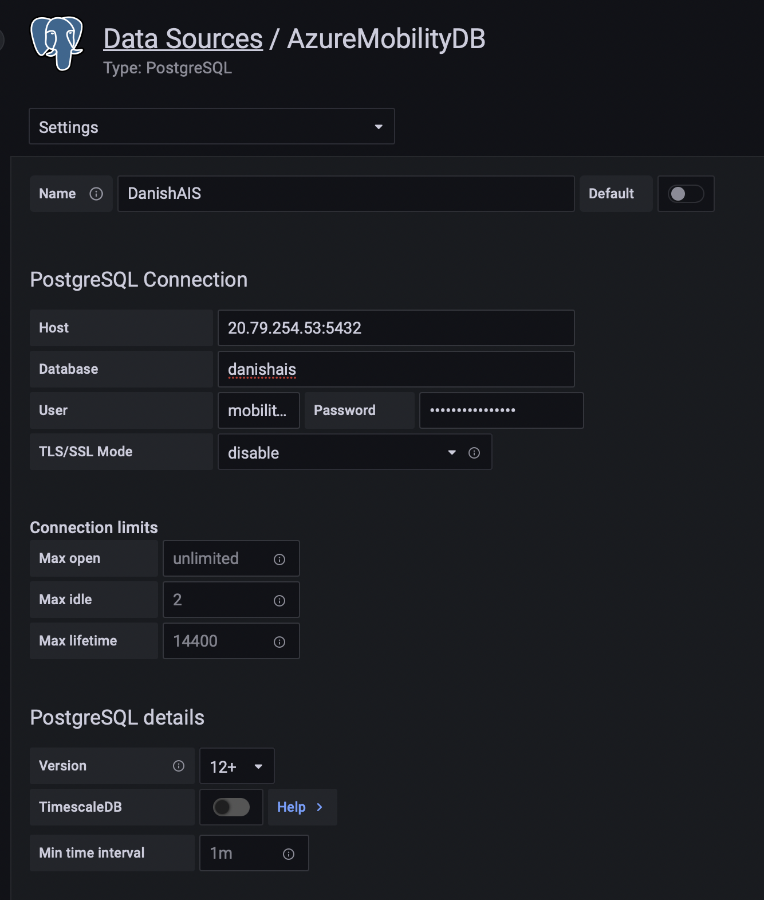

# Creating a Dashboard

With the dashboard configured, and a datasource added, we can now build different panels to visualize data in intuitive ways. 

## Speed of Individual Ships

Let’s visualize the speed of the ships using the previously build query. Here we will represent it as a statistic with a color gradient.

1. Add a new panel
2. Select *DanishAIS* as the data source
3. In Format as, change “Time series” to “Table” and choose “Edit SQL”
4. Here you can add your SQL queries. Let’s replace the exist query with the following SQL script:
    
    ```sql
    SELECT mmsi, ABS( twavg(SOG) * 1.852 - twavg( speed(Trip))* 3.6 ) AS SpeedDifference
    FROM Ships
    ORDER BY SpeedDifference DESC
    LIMIT 5;
    ```
    
5. We can also quickly do some datatype transformations to help Grafana correctly interpret the incoming data. Next to the Query button, select “Transform”, add “Convert field type” and choose *mmsi* as *String.*
    
    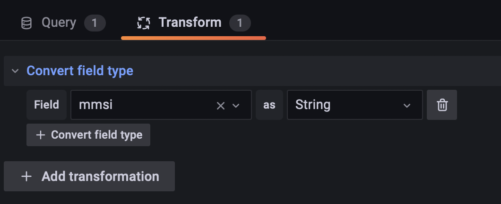
    
6. We will modify some of the visualization options in the panel on the right. 
    
    First, choose *stat* as the visualization
    
    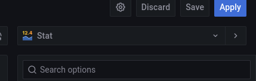
    
    **Panel Options:** Give the panel the title *Incorrect AIS Boat Speed Reporting*
    
    **Value Options:**
    
    - Show: All values
    - Fields: speeddifference
        
        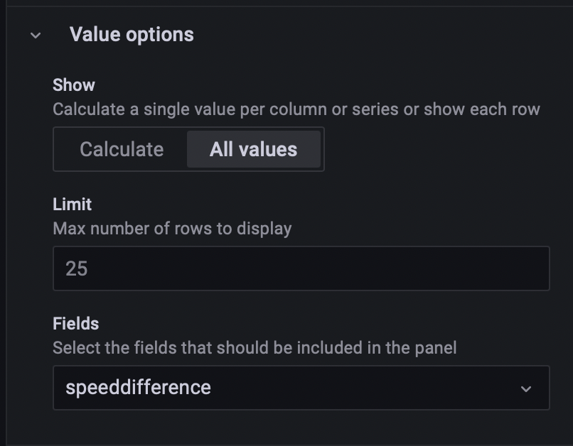
    
    *Note: we can include a limit here instead of in our SQL query as well.*
    
    **Stat Styles:**
    
    - Orientation: Horizontal
        
        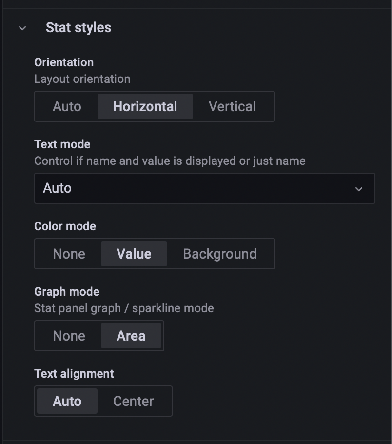
        
    
    **Standard Options:**
    
    - Unit:  Velocity → meter/second (m/s). *Note: you can scroll in the drop down menu to see all options.*
    - Color scheme: Green-Yellow-Red (by value)
    
    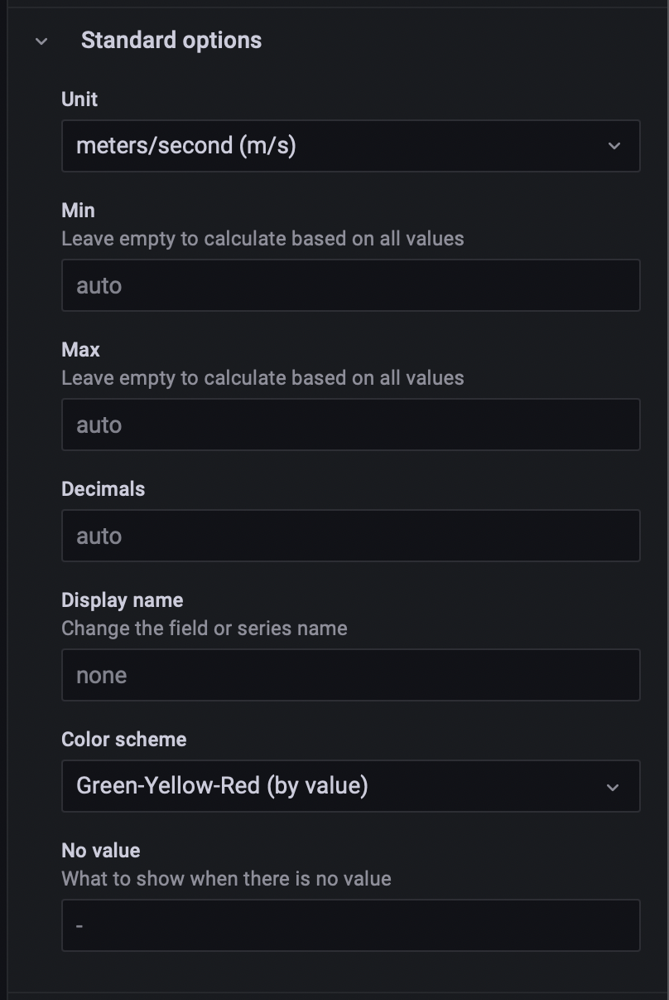
    
    **Thresholds:** 
    
    - remove the existing threshold by clicking the little trash can icon on the right. Adding a threshold will force the visualization to color the data a specific color if the threshold is met.
    
    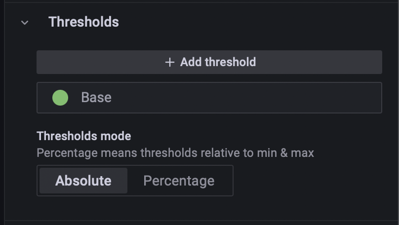
    

The final visualization will look like the screenshot below. 

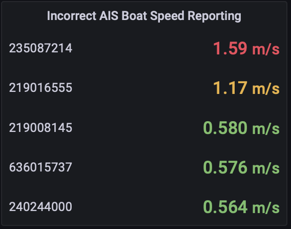

## Routes Used Most Frequently Visualized with a Static Heat Map

We can visualize the routes used by ships with a heat map generated from individual GPS points of the ships. This approach is quite costly, so we will use TABLESAMPLE SYSTEM to specify an approximate percentage of the data to use. If the frequency of locations returned varies in different areas, a heatmap using individual datapoints could be misleading without further data pre-processing. An alternative approach could be to use the postGIS [ST_AsGeoJSON](https://postgis.net/docs/ST_AsGeoJSON.html) to generate shapes in geoJSON format which can be used in [Grafana’s World Map Panel plugin](https://grafana.com/grafana/plugins/grafana-worldmap-panel/). 

1. Add a panel, select DanishAIS as the data source and Format As Table.
2. Using Edit SQL, add the following SQL code:
    
    ```sql
    # NOTE: TABLESAMPLE SYSTEM(40) returns ~40% of the data.
    SELECT
      latitude,
      longitude,
      mmsi
    FROM aisinputfiltered TABLESAMPLE SYSTEM (40)
    ```
    
3. Change the visualization type to *Geomap*.
4. On the map, zoom in to fit the data points into the frame and modify the following visualization options:
    
    **Panel Options:**
    
    - Title: Route Usage Frequency
    
    **Map View:**
    
    - Use current map setting (this will use the current zoom and positioning level as default)
    - Share View: enable (this will sync up the movement and zoom across multiple maps on the same dashboard)
    
    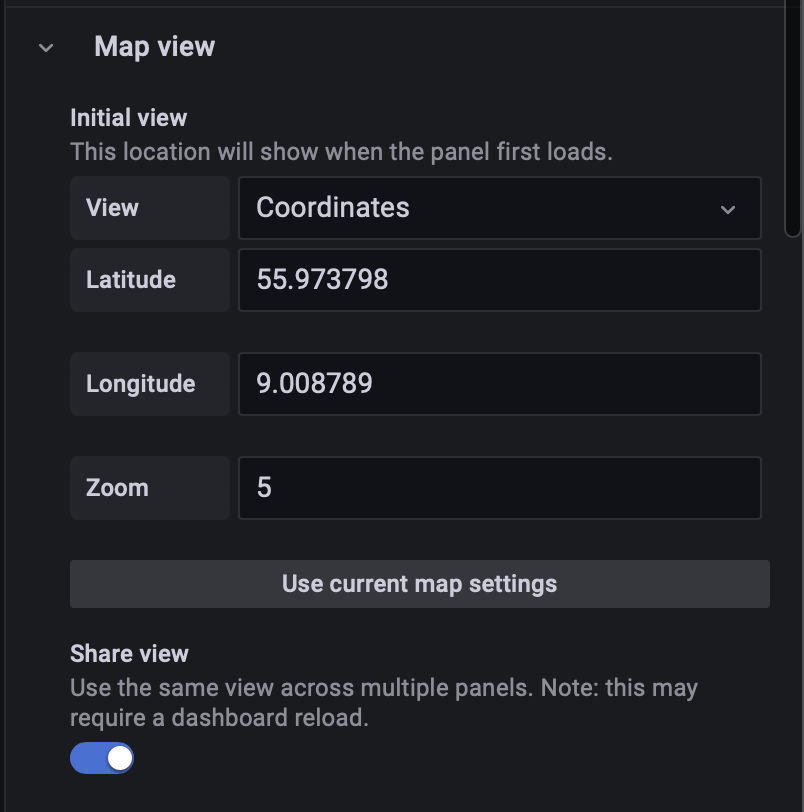
    
    **Data Layer:**
    
    - Layer type: Heatmap
    - Location: Coords
    - Latitude field: latitude
    - Longitude field: longitude
    - Weight values: 0.1
    - Radius: 1
    - Blur: 5
    
    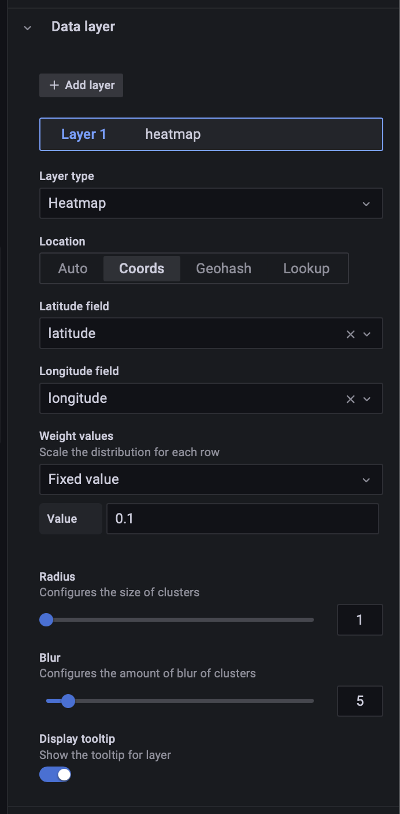
    
    **Standard Options:**
    
    - Color scheme: Blue-Yellow-Red (by value).
    
    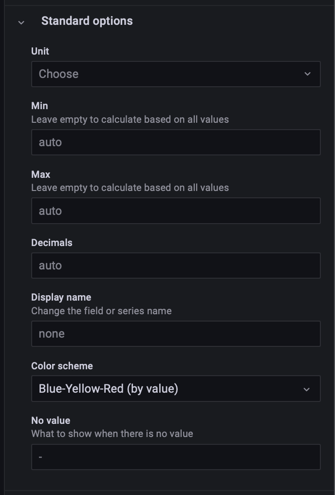
    

The final visualization will look like the screenshot below. Note: The number of datapoints rendered can be manipulated by changing the parameter of the TABLESAMPLE SYSTEM() call in the query.

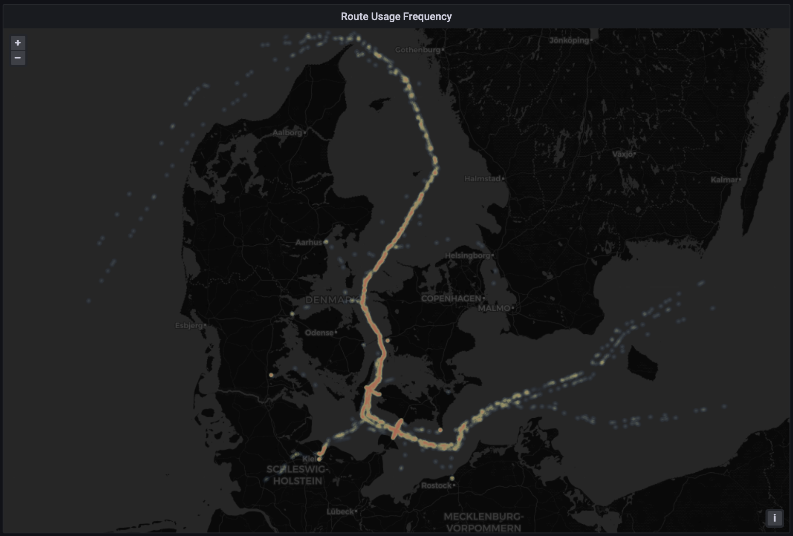

## Number of Boats Moving Through a Given Area

1. Create a new panel, and set DanishAIS as the Source, Format as: “Table”.
2. Select visualization as: “Geomap”
3. Add this SQL in the “SQL editor” section
    
    ```sql
    -- Table with bounding boxes over regions of interest
    WITH ports(port_name, port_geom, lat,lng)
    as (
        SELECT p.port_name, p.port_geom, lat,lng
        FROM
    		-- ST_MakeEnvelope creates geometry against which to check intersection
        ( VALUES ( 'Rodby', ST_MakeEnvelope(651135, 6058230, 651422, 6058548, 25832)::geometry, 54.53,11.06 ),
                ('Puttgarden', ST_MakeEnvelope(644339, 6042108, 644896, 6042487, 25832)::geometry, 54.64,11.36 )
        ) as p(port_name, port_geom, lat,lng)
        )
    
    -- p.lat and p.lng will be used to place the port locaiton on the visualization
    SELECT P.port_name, 
            sum( numSequences( atGeometry( S.Trip, P.port_geom))) AS trips_intersect_with_port,
            p.lat, 
            p.lng
    FROM ports as P, Ships as S
    WHERE intersects(S.Trip, P.port_geom)
    GROUP BY P.port_name, P.lat, P.lng
    ```
    
    *Note: You will see queries are build using the WITH statement (common table expressions - CTE). This helps to break the query down into parts, and also helps make it easier to understand by others.*
    
4. The options (visualization settings - on the right side of the screen) should be as follows:
    
    **Data Layer**
    
    - Layer type: → “markers”
    - Style Size: → “Fixed” and value: 20
    - Color: → “trips_intersect_with_port” (This will color  points on the map based on this value)
    
    **Standard options**
    
    - Min → 88
    - Max → 97
    - Color scheme → “Green-Yellow-Red (by value)”
    
    *Note: At the writing of this tutorial, the Geomap plugin is in beta and has some minor bugs with how colors are rendered based when the “Min” and “Max” values are auto calculated.* 
    

In the visualization below we can see port Rodby has a higher number of ships coming and going to it and that’s why it is colored red. This visualization can show relative activity of ships in regions and ports. 

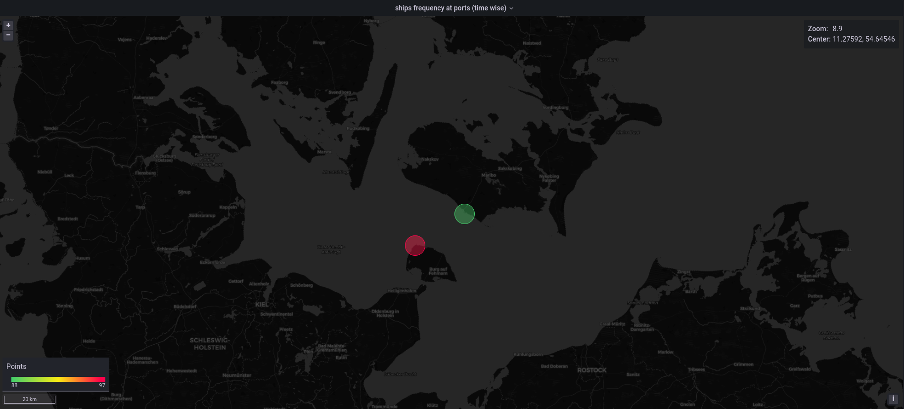

## Boats in Close Proximity in a Given Time Range

Follow the similar steps to add a Geomap panel as before, we include the following SQL script:

```sql
-- 2 CTEs are created to help make these queries more user friendly; TimeShips and TimeClosestShips.

WITH 
		-- The TimeShips CTE returns the data for a time period from 1am to 6:30am
    TimeShips AS (
        SELECT MMSI, 
               atPeriod(S.Trip, period '[2018-01-04 01:00:00, 2018-01-04 06:30:00)' ) AS trip
        FROM 
            Ships S
),
		-- The TimeClosestShips CTE returns the time, location, and closest distance of the boats
		-- that are within 300m of each other. Note the use of dwithin in the WHERE clause
		-- improves performance by limiting the computation to only those ships that were within
		-- 300m.
    TimeClosestShips As (
        SELECT
            S1.MMSI AS "boat1", S2.MMSI AS "boat_2", 
            startValue( atMin(S1.trip <-> S2.trip)) as closet_distance,
            startTimestamp( atMin(S1.trip <-> S2.trip)) as time_at_closest_dist,
            S1.trip as "b1_trip",
            S2.trip as "b2_trip"
        FROM 
            TimeShips S1, TimeShips S2
        WHERE 
            S1.MMSI > S2.MMSI AND
            dwithin(S1.Trip, S2.Trip, 300)
)
-- The final SELECT is used to project the time_at_closest_distance onto the sequence of
-- locations to return the lat and long of both ships. 
SELECT  t.boat1, t.boat_2, t.closet_distance, t.time_at_closest_dist,
        ST_X( ST_Transform( valueAtTimestamp(b1_trip, time_at_closest_dist), 4326) ) as b1_lng,
        ST_Y( ST_Transform( valueAtTimestamp(b1_trip, time_at_closest_dist), 4326) ) as b1_lat,
        ST_X( ST_Transform( valueAtTimestamp(b2_trip, time_at_closest_dist), 4326) ) as b2_lng,
        ST_Y( ST_Transform( valueAtTimestamp(b2_trip, time_at_closest_dist), 4326) ) as b2_lat
        
FROM TimeClosestShips t;
```

To add the points to the map modify the following options:

**Panel Options:**

- Title: Ships within 300m

**Map View:**

- Share view: enabled

**Data Layer:**

- Layer 1: rename to Boat1
- Layer type: Heatmap
- Location: Coords
- Latitude field: b1_lat
- Longitude field: b1_lng
- Radius: 5
- Blur: 15

Click on “+ Add layer” to add another heat map layer to the data, this time using b2_lat and b2_long as the coordinates. We can also add a layer to show the precise locations with markers for both ships (using b1_lat, b1_lng, b2_lat and b2_long), setting each marker to a different color. For the Boat 1 and Boat 2 Locations, we use the following options:

**Data Layer:**

- Value: 1
- Color: select different color for each boat.

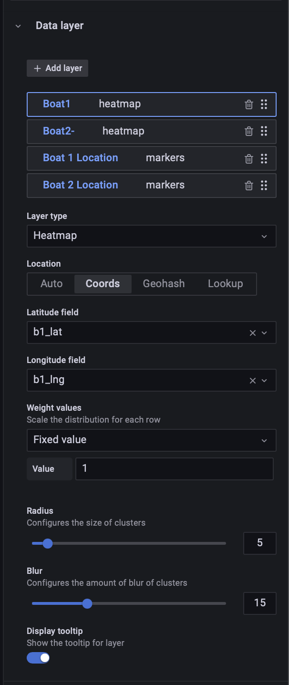

The final visualization looks like the below. 

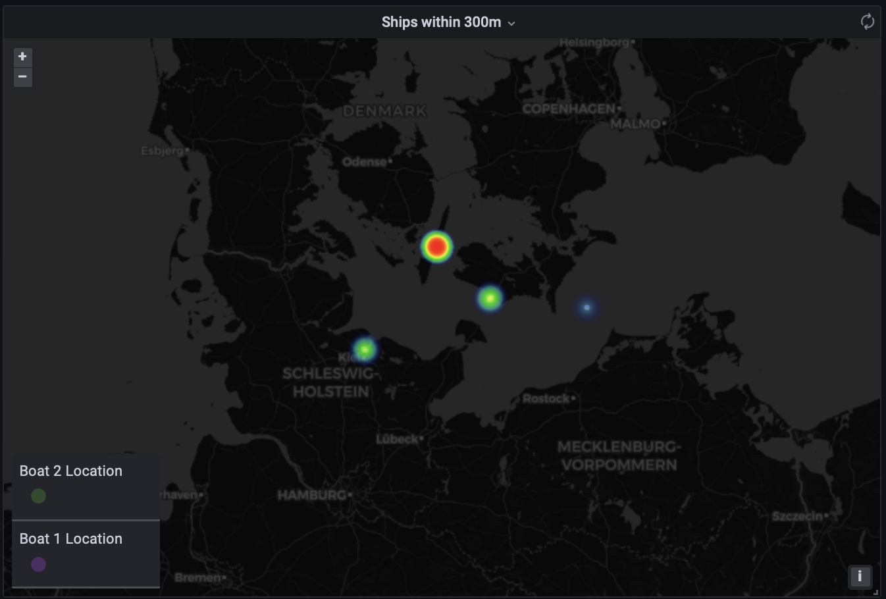

It’s helpful to include the tooltip for layers to allow users to see the data behind the visualization, which helps in interpretation and is a good way for subject matter experts to provide concrete feedback. Using the tooltip, we can quickly see that the same ship can be within 300m to multiple other ships in the same time frame (as seen in the screenshot below). This can result in a higher frequency of results in a heat map view than expected. SQL queries should be modified to ensure they are correctly interpreted. 

Not surprisingly, we see there are lots of results for proximity within ports. We could avoid including results in ports by excluding all results that occur within envelopes defined by ST_MakeEnvelope, as seen in the previous queries. 

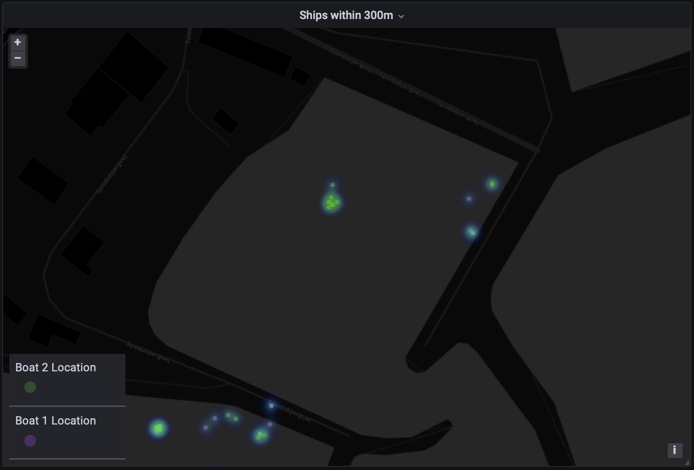

# Dynamic Dashboards - Creating Variables

We can use variables in Grafana to manipulate time-ranges that are used as inputs to MobilityDB queries. We’ll create a drop-down type variable called **“FromTime”** that will be used as an input for the time period within which a query returns results. 

1. In the dashboard window, click “Dashboard settings” icon; the gear symbol, on the top-slightly-right of the window.
    
    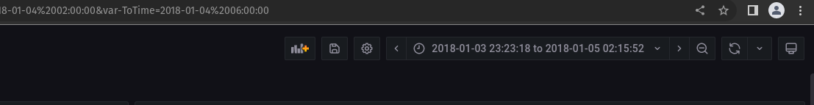
    
2. Click on the “Variables” in the next window on the top-left side of the screen.
    
    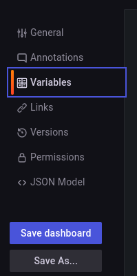
    
3. You’ll see a screen that explains the variables in Grafana and also points to the [Templates and variables documentation](https://grafana.com/docs/grafana/latest/variables/). Click on the “Add variable” button.
4.  In “General”
    - Name → FromTime
    - Type → Custom
5. In “Custom options” we will manually add all the time ranges with 1 hour increment. e.g. “2018-01-04 00:00:00, 2018-01-04 01:00:00 … 2018-01-04 23:00:00”
6. You get a screen like below. Towards the bottom there is also a “Preview of values” that shows what what the drop-down options will look like for the variable you created. In this case, we are creating the timestamps in the same format that MobilityDB will accept.
    
    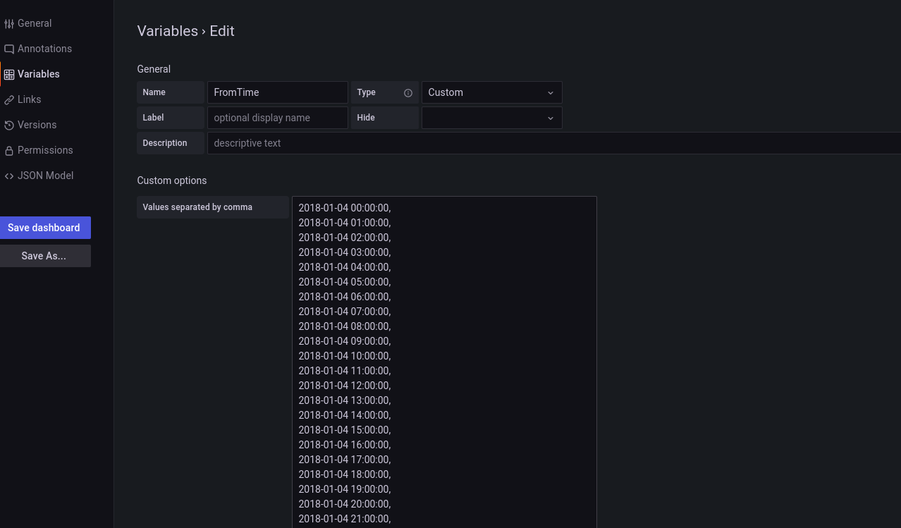
    
7. We can create another variable called “ToTime” with values shifted 1 hour. So the starting value would be “2018-01-04 01:00:00” and the final value will be “2018-01-05 00:00:00”.

Now we can modify some of the queries by including the newly created variables which will return results from a specific time window. We have now provided a user with the ability to dynamically modify visualization queries and slice through time. 

## Dynamic Query: Number of Boats Moving Through a Given Area in a Certain Time Period

In the query code we just need to make slight changes for it to take time values from the variables. In the original query, shown below:

```sql
SELECT P.port_name, 
        sum( numSequences( atGeometry( S.Trip, P.port_geom))) AS trips_intersect_with_port,
        p.lat, 
        p.lng
FROM ports as P, Ships as S
WHERE intersects(S.Trip, P.port_geom)
GROUP BY P.port_name, P.lat, P.lng
```

We just need to modify the trips_intersect_with_port parameter in the SELECT statement to look like:

```sql
sum(numSequences(atGeometry( atPeriod(S.Trip, period '[$FromTime, $ToTime)'), P.port_geom))) AS trips_intersect_with_port,
```

Essentially we just wrapped ‘S.Trip’ with ‘atPeriod()’ and passed our custom period range. The full query with this modification is below:

```sql
-- Table with bounding boxes over regions of interest
WITH ports(port_name, port_geom, lat,lng)
as (
    SELECT p.port_name, p.port_geom, lat,lng
    FROM
    ( VALUES ( 'Rodby', ST_MakeEnvelope(651135, 6058230, 651422, 6058548, 25832)::geometry, 54.53,11.06 ),
            ('Puttgarden', ST_MakeEnvelope(644339, 6042108, 644896, 6042487, 25832)::geometry, 54.64,11.36 )
    ) as p(port_name, port_geom, lat,lng)
    )

SELECT P.port_name, 
        sum(numSequences(atGeometry(atPeriod(S.Trip, period '[$FromTime, $ToTime)'), 
                                    P.port_geom))) AS trips_intersect_with_port,
        p.lat, 
        p.lng
FROM ports as P, Ships as S
WHERE intersects(S.Trip, P.port_geom)
GROUP BY P.port_name, P.lat, P.lng
```

We can select the start time, “FromTime” → “2018-01-04 02:00:00” & “ToTime” → “2018-01-04 06:00:00” . As we can see below, the port Rodby has less activity during this period and that’s why it is green now. But overall Rodby has more activity so when we look at the entire days data it is colored red.

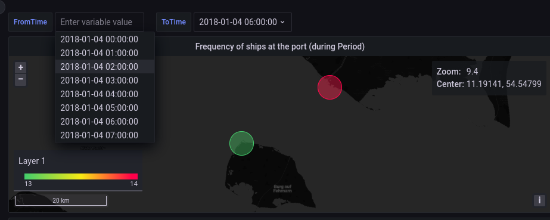

## Global Variables

Grafana also has some [built-in variables (global variables)](https://grafana.com/docs/grafana/latest/variables/variable-types/global-variables/) that can be used to accomplish the same thing we did with custom variables. We can use the global variables ${__from:date} and ${__to:date} instead of the $FromTime and $ToTime we created. The time range can then be modified with the time range options in the top right of the dashboard.

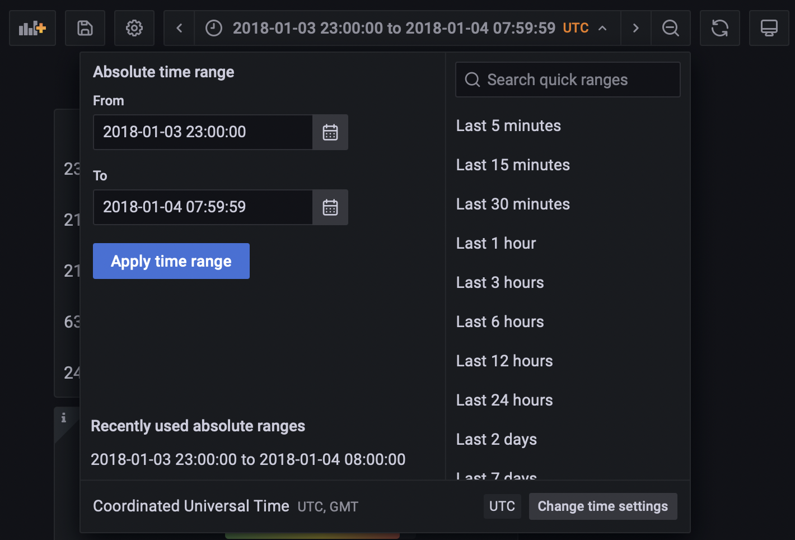

*Note: It is important to be aware of the timezone used for the underlying data relative the the queries for global variables. Time zones can be adjusted at the bottom of the time range selection, “Change time settings”. For this example, we change the time zone to UTC to match our dataset.*

# Final Dashboard

The final dashboard will look like this. Note there are a couple additional query views that were note covered explicitly in the workshop.

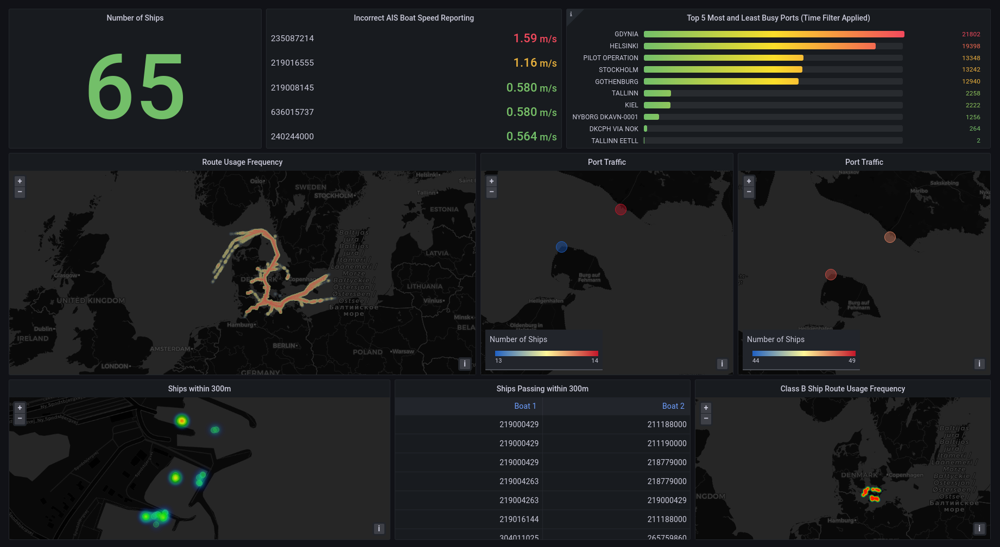